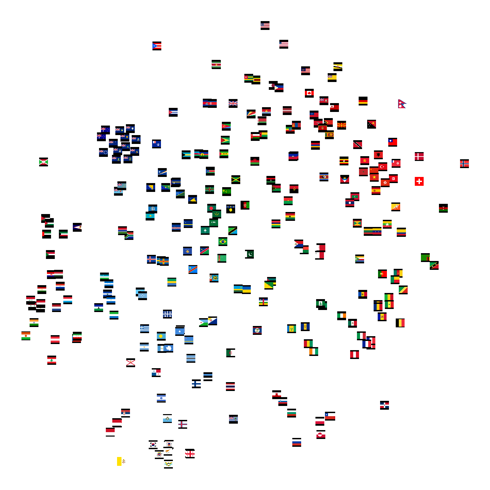

# Latent Flag

When you plot the 2D TNSE representation of RGB images, in general what you find is that images are clustered according the colors. For this particular case I plot the TSNE representation of the flags of the different countries.

As I said, the main feature that cluster the different flags is the color. Then some other features such as vertical or horizontal lines, or the presence of the Great Britain flag inside the flag.

I was wondering how much this changes if we train a convolutional autoencoder using flags and we plot the TSNE of latent representation of the flags.

# Autoencoder

## Data

To train the autoencoder first I used around 3000 synthetic flags using the [FlagsMashupBot](https://github.com/antooro/FlagsMashupBot) and I scrapped around 3000 images from the [FlagsMashupBot twitter account](https://twitter.com/flagsmashupbot
), [twitter scrapper script](./twitter_scrapper.ipynb).
The reason why I scrapped their twitter account is because they have special edition flags that you can't create using the bot.

I used the notebook [preprocess_images.ipynb](./preprocess_images.ipynb) to resize all the images to squared shape and some other images preprocessing.

## Autoencoder
Then I trained a very simple convolutional autoencoder following the first part of the notebook [autoencoder_generation_and_tsne_representation.ipynb](./autoencoder_generation_and_tsne_representation.ipynb).

## TSNE representation
The second part of the notebook
[autoencoder_generation_and_tsne_representation.ipynb](./autoencoder_generation_and_tsne_representation.ipynb) contains the code snippets used to generate the latent space of the real flags and plot the TSNE representation of the images.

### Resources

- JSON of countries and flags https://restcountries.eu/rest/v2/all
- Generation of synthetic flags using Flags Mashup Bot https://github.com/antooro/FlagsMashupBot, https://twitter.com/flagsmashupbot
